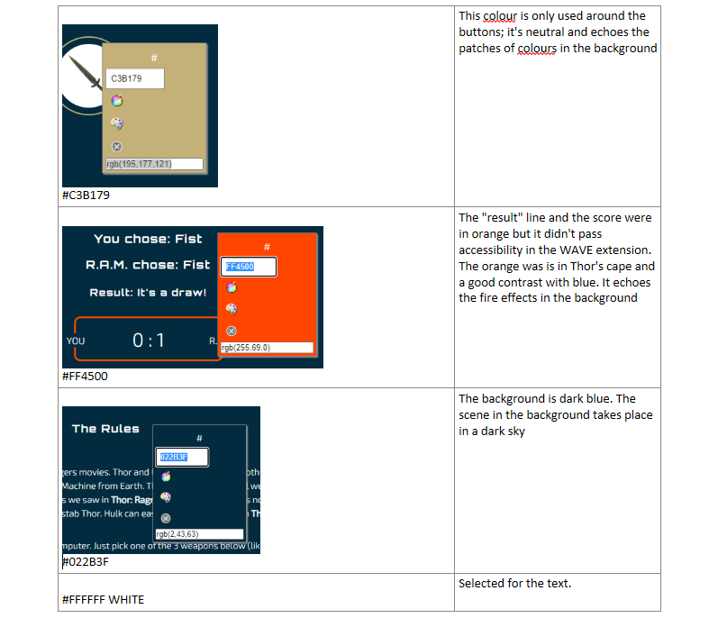
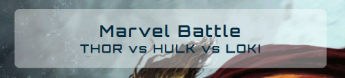
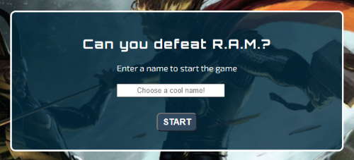

<h1 text-align="center">MARVEL BATTLE</h1>

Click on [Marvel Battle](https://annickrynne.github.io/MarvelBattle/) to access the live project.

# INTRODUCTION
This application is a game based on the Rock-Paper-Scissors game. I decided to give it a twist by using three Marvel heroes (well, 2 heroes and 1 bad guy, I ought to say!). Based on the Avengers movies, I decided that
   - Thor > Hulk but < Loki
   - Hulk > Loki but < Thor
   - Loki > Thor but < Hulk

Of course, the above is very debatable. I based my research on the following articles, mostly found on the Screenrant website: 

- [Hulk vs Thor: Who the Most Powerful Was in the Avengers 2012](https://screenrant.com/avengers-2012-movie-hulk-thor-most-powerful-reason/)
 - [10 Times Loki Proved He Was The Strongest Asgardian](https://www.cbr.com/loki-strongest-asgardian-mcu/)
 - [Loki Names One Avenger Strong Enough To Kill Thor (And It's Not Hulk)](https://screenrant.com/loki-avenger-kill-thor-hercules-not-hulk/)

 Finally, some images from the movies:
 - [Hulk vs Loki - "Puny God"- Hulk Smashing Loki - The Avengers 2017 | Movie CLIP HD](https://www.youtube.com/watch?v=31ZjnrHR8EA)

- [Thor vs Hulk - Fight Scene - The Avengers (2012) Movie Clip HD](https://www.youtube.com/watch?v=SLD9xzJ4oeU)

  

# EXPERIENCE (UX)
The target audience: Mainly, adults and children who like playing games on their phones, fans of the Marvel movies, fans of the Marvel cartoon strips.

## User Stories
1. First Time Visitor Goals
   - I want the rules to be easy to grasp (is this based on Rock Paper Scissors?)
   - I want to know my score against the computer

2. Returning Visitor Goals
   - I want to play again because I like the graphics
   - I want to get a higher score (although I'm aware it's based on chance)

3. Frequent User Goals
   - I want to see if there is any added features

## Design

As the game is based on Marvel characters, I chose a science-fiction/Avengers look. 

1. Colour Scheme

   I picked the colors from the background: a dark blue, hints of orange and greeny-beige, constrating with white (for accessibility reasons). 
 
 
 
 

2. Typography

   I wanted fonts that looked futuristic.  I picked Orbitron for titles and Exo for the text. These fonts were suggested in this site:
   [25+ Best Sci-Fi and Techno Fonts for Futuristic Designs](https://superdevresources.com/techno-sci-fi-fonts/)

3. Imagery

- The 'wallpaper' image I chose for the background consists of two merged illustrations: Hulk at the front and Thor fighting with Loki at the back). The image sets the mood: They are fighting in a dramatic and dark environment. The illustrations are based on the Avengers movies (and actors). 
- The 3 buttons in the 'Controls' div of the Game section are images representing the weapons: the game "rock-paper-scissors" is almost always represented by graphics (hand gestures).
- The image in the background is a striking feature: I used opaque backgrounds for the content (header/register/footer) so that the image can still be visible and enjoyed.

## Wireframes
I kept the design very simple as it is a simple game, almost intuitive: Like all 'rock-paper-scissors' game apps, it needs 3 buttons to play and a score-board, and that's about it. I explain the rules at the top. The 'register' section was added later. 

### Mobile wireframe:

### Ipad wireframe:

### Laptop wireframe:

# FEATURES
 When you open the application, you see 3 sections. The header and the footer remain visible during the game, but the game section is only visible when you click on START after having registered a name. 

## Header
At first, I'd named the game 'Avengers Battle', but was pointed out that Loki wasn't an Avenger! So, it became 'Marvel Battle'. Thor vs Hulk vs Loki hints at a rock vs paper vs scissors semantically. Also, you'll see from my sources that the articles and YouTube videos of the fights use 'Loki vs Thor' for example. 

## Section 1: Register
- This section has a title: Defeating the 'computer' didn't sound very scary, so I called it R.A.M. (Ramdom Access Memory, which is how the computer makes its choices in the game!). For the fans of science-fiction, it's also a hint to H.A.L. (Heuristically programmed ALgorithmic computer in the movie '2001: A Space Odyssey). For those who don't know H.A.L., R.A.M. sounds mysterious and more powerful in any case.

- The player is invited to enter ANY name, just for fun, but it is required to start the game. Then, of course, you have a START button. Once clicked, it opens the Game section. An alert is triggered if the player doesn't enter a name first:

## Section 2: Game

 

# Div 1 - Rules
The rules consists of 2 paragraphs (see above image), in EXO font:
- The first paragraph explains the theme of the game, why Loki, Thor and Hulk were chosen and what they fight with (to understand the weapons below).
- The second paragraph explains who you're playing against (R.A.M. IS a computer) and how it works.

# Div 2 - Controls
The player selects a weapon of his choice: the hammer for Thor, the fist for Hulk, the dagger for Loki. An orange circle appears when they go over a button (image in div 4).

# Div 3 - Choice of weapon
The choice of both players is printed below, once the player has clicked on a weapon (see image in div 4 below).

# Div 4 - Result
The result display the name registered by the player and whether he/she wins, loses, or it's a draw.

# Div 5 - Score Board
This final div of the game section displays the score for the player and R.A.M.

## Footer
It contains just a copyright for now.

## Future features
- Dramatic sound effects would be fun to add to this game, when the player wins/loses, or even when you click on START
- More heroes or bad guys could be added to the game (like in The Big Bang Theory, Sheldon's idea of a new game: Rock Paper Scissors Lizard Spock). The game should evolve with the Avengers and other Marvel series/movies.
- More graphics could be added too
- There's currently no limit to the game: a 'game over' could be added after a certain score is reached or a certain number of rounds
 

# TECHNOLOGIES USED
## Languages
- HTML
- CSS
- JAVASCRIPT

## Frameworks
      - Google Fonts: Imported Orbitron and EXO (See Design: Typography)
      - Font Awesome: Used the copyright icon in the footer
      - Git: Used for version control by utilizing the Gitpod terminal to commit to Git and Push to GitHub
      - GitHub: Used to store the projects code after being pushed from Git

## Programmes and tools
      - Photoshop: used to create the background cover image and resize button images, using layers
      - Paint: used for the screenshots in DOCS
      - Balsamiq: Used to create the wireframes during the design process
      - Chrome extensions: 
      - Fonts Ninja, Eye Dropper, Window Resizer, Dimensions, Image Size Info: Used when doing research on fonts, colors and images
      - WAVE Evalutation Tool: Used when testing accessibility

# TESTING
I tested my JavasCript code in JS Hint. It came back with a few 
# ACCESSIBILITY

# DEPLOYMENT
This site was deployed to GitHub pages as per the following steps: 
<ul>
   <li>In the GitHub repository, select MarbelBattle repository</li>
   <li>Navigate to the Settings tab and scroll down to the GitHub Pages, to "Pages settings now has its own dedicated tab!" and click on the link that says "Check it out here!"</li>
   <li>Select a source by clicking where it says "none" and then select "main"</li>
   <li>Scroll down to the bottom of the page, to the GitHub Pages section and you will see the link to the website</li>
</ul>

# CREDITS
